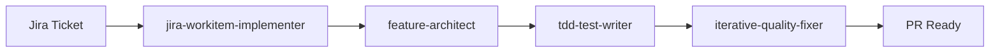
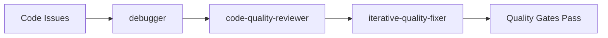

# Claude Code Agents

> **Specialized agents for autonomous development workflows**

---

## 🚀 Quick Start

**Need to implement a Jira ticket?**  
→ `jira-workitem-implementer`

**Building a new feature?**  
→ `feature-architect`

**Code quality issues?**  
→ `iterative-quality-fixer`

**PR feedback to address?**  
→ `pr-review-comment-resolver`

---

## 🏗️ Architecture Overview

```
┌─────────────────┐    ┌─────────────────┐
│  ORCHESTRATORS  │    │   SPECIALISTS   │
│                 │    │                 │
│ Complex         │────│ Single-purpose  │
│ Multi-step      │    │ Domain experts  │
│ Workflows       │    │                 │
└─────────────────┘    └─────────────────┘
```

**Orchestrators** manage end-to-end workflows  
**Specialists** provide focused expertise

---

# 🎯 Core Agents

## Orchestrators

### 🧭 [`feature-architect`](feature-architect.md)
**3-phase development: explore → plan → implement**
- Complex features, architectural changes, multi-component bugs
- *Delegates to: tdd-test-writer, debugger, code-quality-reviewer*

### 🎫 [`jira-workitem-implementer`](jira-workitem-implementer.md) 
**Complete ticket automation: analysis → code → PR**
- Full development lifecycle from Jira ticket to merged PR
- *Delegates to: jira-workitem-analyzer, feature-architect, tdd-test-writer*

### 🔄 [`iterative-quality-fixer`](iterative-quality-fixer.md)
**Systematic fix-test-verify cycles**
- Quality enforcement, automated improvement workflows
- *Delegates to: debugger, code-quality-reviewer*

### 💬 [`pr-review-comment-resolver`](pr-review-comment-resolver.md)
**PR feedback resolution**
- Fetches, categorizes, and addresses all PR comments systematically
- *Delegates to: iterative-quality-fixer*

## Specialists

<details>
<summary><strong>🛠️ Development & Testing</strong></summary>

- **[`tdd-test-writer`](tdd-test-writer.md)** - Test-first development methodology
- **[`debugger`](debugger.md)** - Error resolution and troubleshooting

</details>

<details>
<summary><strong>✅ Code Quality</strong></summary>

- **[`code-quality-reviewer`](code-quality-reviewer.md)** - Production-ready code analysis
- **[`code-comment-reviewer`](code-comment-reviewer.md)** - Comment quality and relevance

</details>

<details>
<summary><strong>📋 Project Management</strong></summary>

- **[`jira-workitem-analyzer`](jira-workitem-analyzer.md)** - Ticket analysis and requirements
- **[`pr-comment-validator`](pr-comment-validator.md)** - Outdated comment detection

</details>

<details>
<summary><strong>📚 Content & Meta</strong></summary>

- **[`information-consolidator`](information-consolidator.md)** - Information organization
- **[`meta-agent`](meta-agent.md)** - Agent configuration generation

</details>

---

# 🔗 Common Workflows

## Feature Development


## Quality Pipeline


---

# 🎪 Usage Patterns

## By Scenario

| **Scenario** | **Agent** | **Why** |
|---|---|---|
| 🎯 **New Feature** | `feature-architect` | Systematic exploration and planning |
| 🎫 **Jira Ticket** | `jira-workitem-implementer` | End-to-end automation |
| 🚨 **Bugs/Errors** | `debugger` | Specialized troubleshooting |
| ✅ **Quality Issues** | `iterative-quality-fixer` | Systematic improvement cycles |
| 💬 **PR Feedback** | `pr-review-comment-resolver` | Comprehensive comment handling |

## Proactive Automation
*These agents activate automatically:*

- 🚨 `debugger` → Any errors detected
- 🔍 `code-quality-reviewer` → After significant code changes  
- ⚡ `iterative-quality-fixer` → Quality improvements needed
- 📋 `jira-workitem-analyzer` → Working with tickets
- 📚 `information-consolidator` → Scattered content detected

---

# 📖 Examples

<details>
<summary><strong>Complete Jira Implementation</strong></summary>

```bash
jira-workitem-implementer "APL-1234"
# → Analyzes ticket, plans implementation, writes tests, creates PR
```

</details>

<details>
<summary><strong>Feature Development</strong></summary>

```bash
feature-architect "implement OAuth authentication"
# → Explores codebase, plans approach, guides implementation
```

</details>

<details>
<summary><strong>PR Review Workflow</strong></summary>

```bash
pr-review-comment-resolver "PR #123"    # Address all feedback
pr-comment-validator "PR #123"          # Clean outdated comments  
```

</details>

---

<details>
<summary><strong>🔧 Technical Reference</strong></summary>

### Tool Access Patterns
- **`*`** = Full tool access (orchestrators)
- **Specialized** = Domain-specific tools only
- **Read-only** = Analysis agents

### Color System
- 🟢 Quality & Review
- 🔴 Debugging & Errors  
- 🟡 Development & Testing
- 🟣 PR Management
- 🟠 Integration & Workflows
- 🔵 Information & Meta

</details>